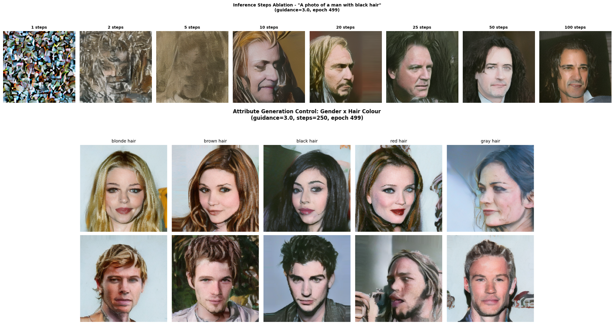

# Text-to-Image Generation Using CLIP-Conditioned Diffusion Models with Classifier-Free Guidance

**M.Sc. Final Project — The Open University, Department of Mathematics and Computer Science**

**Author:** Shlomi Domnenco  
**Supervisors:** Dr. Mireille Avigal & Dr. Azaria Cohen  
**Submitted:** March 2026

---




## Overview

This project implements a text-to-image generation model based on **Stable Diffusion** with **CLIP embeddings** as the text conditioning mechanism and **Classifier-Free Guidance (CFG)**. The model operates in latent space via a Variational Autoencoder (VAE) for computational efficiency.

Experiments are conducted on four datasets of increasing complexity, demonstrating that diffusion-based models substantially outperform GAN-based approaches (particularly Creative Adversarial Networks / CAN) in image quality and stability.

---

## Repository Structure

```
final_project/
├── notebooks/
│   ├── 01_mnist_experiment/          # MNIST text-to-image experiments
│   │   ├── train1_t2i_mnist_cfg.ipynb
│   │   ├── train2_train_mnist_classifier.ipynb
│   │   ├── inference1_t2i_mnist_cfg.ipynb
│   │   ├── metrics2_evaluate_t2i_mnist.ipynb
│   │   └── metrics3_pytorch_fid.ipynb
│   ├── 02_cifar10_experiment/        # CIFAR-10 text-to-image experiments
│   │   ├── train1_t2i_cifar10_cfg.ipynb
│   │   ├── inference1_t2i_cifar10_cfg.ipynb
│   │   └── metrics1_evaluate_cifar10.ipynb
│   ├── 03_wikiart_experiment/        # WikiArt artistic style generation
│   │   ├── train1_t2i_wikiart_cfg.ipynb
│   │   ├── train2_t2i_wikiart_cfg_continue.ipynb
│   │   ├── train2_train_wikiart_classifier.ipynb
│   │   ├── inference1_t2i_wikiart_cfg.ipynb
│   │   └── metrics1_evaluate_wikiart.ipynb
│   └── 04_celeba_hq_experiment/      # CelebA-HQ face generation (LDM + CFG)
│       ├── train1_t2i_celeba_hq_ldm_cfg.ipynb
│       ├── train2_t2i_celeba_hq_ldm_cfg.ipynb
│       ├── train3_t2i_celeba_hq_ldm_cfg_500epochs.ipynb
│       ├── inference1_t2i_celeba_hq_ldm_cfg.ipynb
│       ├── inference4_guidance_scale_sweetspot.ipynb
│       ├── inference5_paper_figures.ipynb
│       └── plot_loss_500_epochs.ipynb
├── checkpoints/                      # Saved model checkpoints (.pt files)
├── outputs/                          # Evaluation results and figures
├── dataset_cache/                    # Downloaded datasets
├── slurm/                            # SLURM job scripts for HPC cluster
├── config.py                         # Global configuration
├── mnist_classifier.py               # MNIST classifier for FID evaluation
├── wikiart_classifier.py             # WikiArt classifier for evaluation
├── wikiart_dataset_custom.py         # Custom WikiArt dataset loader
├── metrics_mnist_fid.py              # FID computation utilities
└── research-paper/                   # LaTeX source for the research paper
```

---

## Experiments

| # | Dataset | Task | Model |
|---|---------|------|-------|
| 1 | MNIST | Text-to-image (digit class) | UNet + CLIP CFG |
| 2 | CIFAR-10 | Text-to-image (object class) | UNet + CLIP CFG |
| 3 | WikiArt | Text-to-image (art style) | UNet + CLIP CFG |
| 4 | CelebA-HQ | Text-to-image (face attributes) | LDM + CLIP CFG (500 epochs) |

---

## Setup

### Prerequisites

- Python 3.10
- CUDA 11.8
- PyTorch 2.7.1+cu118

### Conda Environment

This project uses the `shlomid_conda_12_11_2025` conda environment:

```bash
conda activate /home/doshlom4/work/conda/envs/shlomid_conda_12_11_2025
```

### Jupyter Kernel

All notebooks use the **"Python 3.10 (Stable Diffusion - CUDA 11.8)"** kernel located at:
```
/home/doshlom4/.local/share/jupyter/kernels/stable_diffusion_cuda118/
```

---

## Running Experiments

Each experiment folder follows the naming convention:
- `train*.ipynb` — Training notebooks (run first)
- `inference*.ipynb` — Image generation / inference
- `metrics*.ipynb` — Quantitative evaluation (FID, IS, etc.)

### Example: MNIST experiment

```bash
cd notebooks/01_mnist_experiment
# Open and run in order: train1 → train2 → inference1 → metrics2 → metrics3
```

### HPC / SLURM

For running on the HPC cluster, SLURM job scripts are available in the `slurm/` directory. To start a Jupyter Lab session on a GPU node:

```bash
bash slurm/jupyter_lab.sh
```

---

## Path Convention

All notebooks use **absolute paths** anchored to the project root:

```python
from pathlib import Path
PROJECT_ROOT = Path("/home/doshlom4/work/final_project")
```

Datasets are cached at `PROJECT_ROOT / "dataset_cache"` to respect HPC home directory quotas.

---

## Key Dependencies

| Package | Purpose |
|---------|---------|
| `torch` / `torchvision` | Deep learning framework |
| `diffusers` | Diffusion model components |
| `transformers` | CLIP text encoder |
| `datasets` | HuggingFace dataset loading |
| `pytorch-fid` | FID metric computation |
| `Pillow` | Image processing |

---

## Research Paper

The full research paper (LaTeX source) is in the `research-paper/` directory. To build the PDF:

```bash
cd research-paper
bash build.sh
```

---

## License

This project was developed as an academic M.Sc. thesis at The Open University of Israel.
